# ⚡ PZ-iot-power-meter

## Содержание

- [👓 Обзор проекта](#-обзор-проекта)
- [✨ Основные возможности](#-основные-возможности)
- [🛠️ Необходимые компоненты](#%EF%B8%8F-необходимые-компоненты)
- [🔌 Схема подключения](#-pz-iot-power-meter--схема-подключения)
- [📡 Подключение](#-подключение)
  - [⚡ Питание](#-питание)
  - [📡 Связь (UART)](#-связь-uart)
- [🧩 Компоненты](#-компоненты)
- [⚠️ Меры безопасности](#️-меры-безопасности)
- [📂 Особенности конфигурации](#-особенности-конфигурации)
- [🚀 Начало работы](#-начало-работы)
- [🔗 Интеграция с Home Assistant](#-интеграция-с-home-assistant)
- [📱 Примеры интерфейса HA и WEB](#-примеры-интерфейса-ha-и-web)
- [📸 Примеры готового устройства](#-примеры-готового-устройства)
- [⁉️ Возможные трудности](#️-возможные-трудности)


# 👓 Обзор проекта

**Умный счётчик электроэнергии на PZEM-004T**

Готовое решение для мониторинга электроэнергии на базе ESPHome, микроконтроллера BK7231 (модуль CB3S) и сенсора PZEM‑004T. Проект превращает обычный счётчик в полноценное умное устройство с веб‑интерфейсом, детальной статистикой и интеграцией с Home Assistant.


Идеально подходит для контроля электропотребления, расчёта затрат на электричество и мониторинга качества сети в вашем умном доме.

---


## ✨ Основные возможности


- **Мониторинг в реальном времени**: измеряет напряжение (В), ток (А), мощность (Вт), частоту (Гц) и коэффициент мощности (cos φ).
- **Учёт потребления**: автоматически ведёт учёт электроэнергии с ежедневным, еженедельным и ежемесячным сбросом показаний.
- **Расчёт стоимости**: считает затраты на электроэнергию на основе настраиваемого тарифа (руб/кВт⋅ч).
- **Синхронизация с внешним счётчиком**: позволяет ввести показания вашего обычного счётчика и синхронизировать с ними данные PZEM.
- **Веб‑сервер**: имеет встроенный веб‑интерфейс с удобной группировкой параметров, который работает даже без Home Assistant.
- **Анализ качества энергии**: автоматически рассчитывает полную (ВА) и реактивную (ВАР) мощность.
- **Умные оповещения**: бинарные сенсоры сообщают о наличии нагрузки, перегрузке и низком коэффициенте мощности.
- **Надёжное подключение**: поддержка двух Wi‑Fi сетей и режим точки доступа для лёгкого восстановления подключения.

---

## 🛠️ Необходимые компоненты

Для сборки устройства вам потребуются:

- **Микроконтроллер**: модуль на базе чипа BK7231 (например, CB3S, WB3S, WB2S). Конфигурация оптимизирована для платы CB3S.
- **Датчик энергии**: модуль PZEM‑004T V3.0. Популярный счётчик электроэнергии с интерфейсом Modbus (TTL).
- **Блок питания**: стабильный источник питания 3.3 В для модуля BK7231 (или 5 В в зависимости от вашей платы, так как конфиг масштабируемый и его легко переделать и для ESP8266 или ESP32, в зависимости от ваших потребностей).

## 🔌 PZ IoT Power Meter — Схема подключения
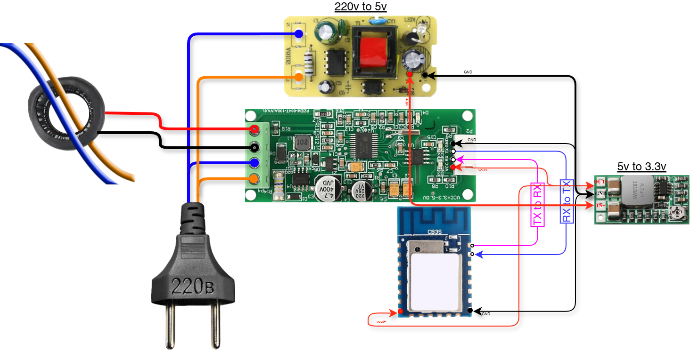

## 📡 Подключение

### ⚡ Питание
1. **220В AC** → на вход AC-DC преобразователя (блока питания на 5В в моем примере) (220В → 5В) и вход питания pzem-004t
2. **5В** → на вход DC-DC понижающего модуля (5В → 3.3В)  (или линейного стабилизатора AMS1117-3.3 с обвязкой )
3. **3.3В** → VCC микроконтроллера (CB3S(для esp8266 аналогично)) и VCC UART части pzem-004t
4. **GND** → GND микроконтроллера и GND UART части pzem-004t

### 📡 Связь (UART)
| Микроконтроллер | PZ IoT Power Meter |
|-----------------|-------------------|
| TX | RX+ |
| RX | RX- |
| VCC | VCC |
| GND | GND |


## 🧩 Компоненты
- AC-DC 220В → 5В (с гальванической развязкой)
- Стабилизатор 5В → 3.3В (DC-DC преобразователь с 5 на 3.3 вольта или AMS1117-3.3 с обвязкой)
- Микроконтроллер CB3S(или ESP8266 с обвязкой для запуска и правкой конфига)
- PZEM-004t v3 или v4


## ⚠️ Меры безопасности
- Все соединения 220В изолировать
- Крайне важно использовать только изолированный AC-DC преобразователь с гальванической развязкой
- Проверить логические уровни счётчика (5В или 3.3В)
- Не подключать 220В в UART часть pzem-004t


---

## 📂 Особенности конфигурации
В качестве основы для построения конфигурации использовался стандартный конфиг для обьявления сенсоров: 
```yaml
modbus:

sensor:
  - platform: pzemac
    current:
      name: "PZEM-004T V3 Current"
    voltage:
      name: "PZEM-004T V3 Voltage"
    energy:
      name: "PZEM-004T V3 Energy"
    power:
      name: "PZEM-004T V3 Power"
    frequency:
      name: "PZEM-004T V3 Frequency"
    power_factor:
      name: "PZEM-004T V3 Power Factor"
    update_interval: 60s
```
Оригинал по ссылке [Тык](https://esphome.io/components/sensor/pzemac/).

Конфигурация построена на возможностях ESPHome и включает в себя ряд продуманных решений:

- **Modbus‑связь**: используются компоненты `modbus` и `uart` для обмена данными с PZEM‑004T на скорости 9600 бод.
- **Автоматический сброс счётчиков**: специальный `interval` каждую минуту отслеживает дату и автоматически обнуляет дневные, недельные и месячные показатели в нужный момент.
- **Сохранение данных**: данные о накопленной энергии и смещении показаний счётчика хранятся в `globals` с восстановлением после перезагрузки.
- **Удобный веб‑интерфейс**: все сенсоры и элементы управления разделены на логические группы в веб‑сервере: основные параметры, энергия и стоимость, качество питания, диагностика и т. д.
- **Защита от выбросов**: добавлены фильтры для всех сенсоров, отсекающие некорректные показания (например, напряжение 0 В или частота 100 Гц).

---

## 🚀 Начало работы

1. **Установите ESPHome**: если ещё не сделали этого, установите ESPHome (панель управления или командная строка).
2. **Скопируйте конфигурацию**: возьмите готовый YAML‑файл из этого репозитория.
3. **Настройте секреты**: замените все `!secret` на реальные данные. Создайте файл `secrets.yaml` рядом с конфигурацией:

    ```yaml
    wifi_ssid: "Имя вашей Wi-Fi сети"
    wifi_password: "Пароль"
    wifi_ssid2: "Резервная сеть"
    wifi_password2: "Пароль резервной сети"
    api_encryption_key: "Сгенерированный ключ шифрования"
    ```

4. **Настройте параметры (опционально)**: при необходимости измените `device_timezone` (часовой пояс) и `electricity_tariff` (тариф по умолчанию 7.1 руб/кВт⋅ч).
5. **Скомпилируйте и загрузите**: скомпилируйте прошивку и загрузите её на плату `BK7231` (по UART или по воздуху после первой прошивки).
6. **Откройте веб‑интерфейс**: после подключения к Wi‑Fi откройте IP‑адрес устройства в браузере.

---

## 🔗 Интеграция с Home Assistant

-  Устройство полностью и без проблем интегрируется с `Home Assistant`. Благодаря использованию нативного `API ESPHome`

---

## 📱 Примеры интерфейса HA и WEB

-  Делее пример того как конфигурациия выглядит в `Home assistent` и как выглядит напрямую через `WEB`.

<details>
<summary><b>🖥️ Нажмите, чтобы открыть примеры интерфейсов</b></summary>
<br>

<div align="center">
  
  **Home Assistant**
  
  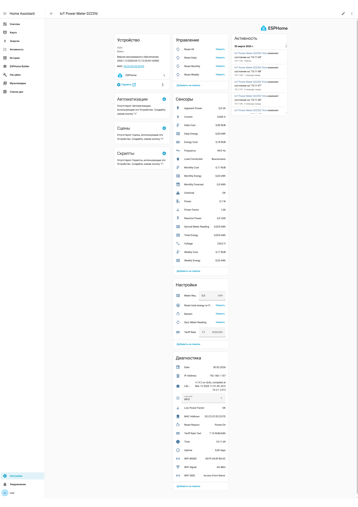
  
  <br><br>
  
  **Веб-интерфейс**
  
  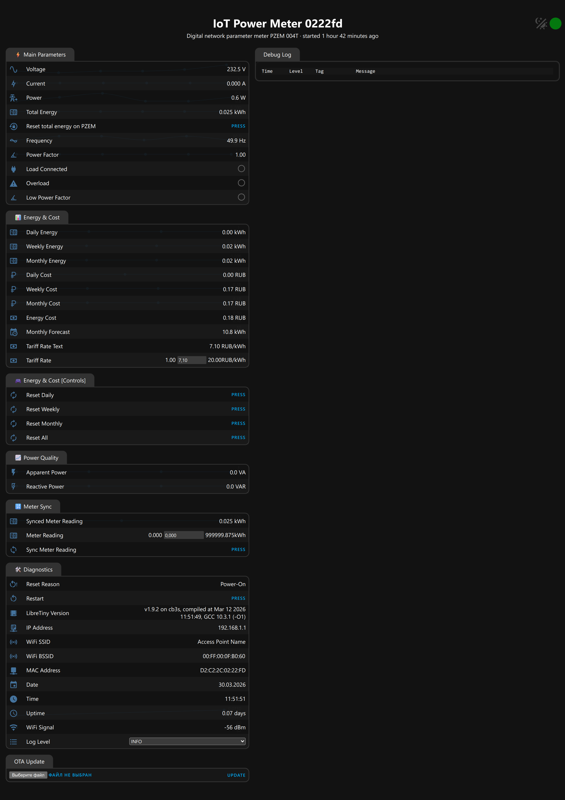
  
  <br>
  
  *Интерфейсы для мониторинга электроэнергии*
  
</div>

</details>

## 📸 Примеры готового устройства

<details>
<summary><b>🖼️ Нажмите, чтобы открыть галерею (9 фотографий)</b></summary>
<br>

<div align="center">
  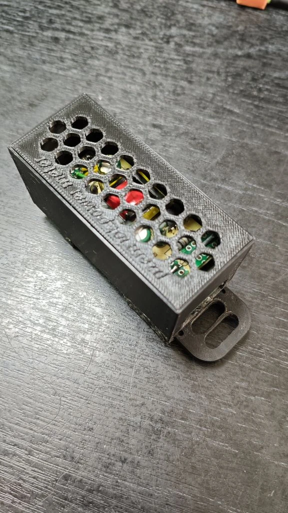
  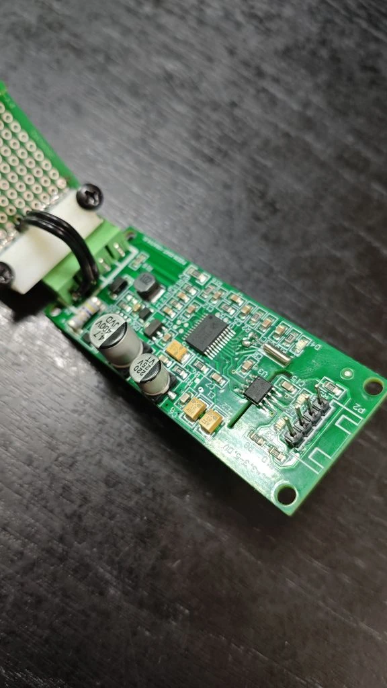
  <br><br>
  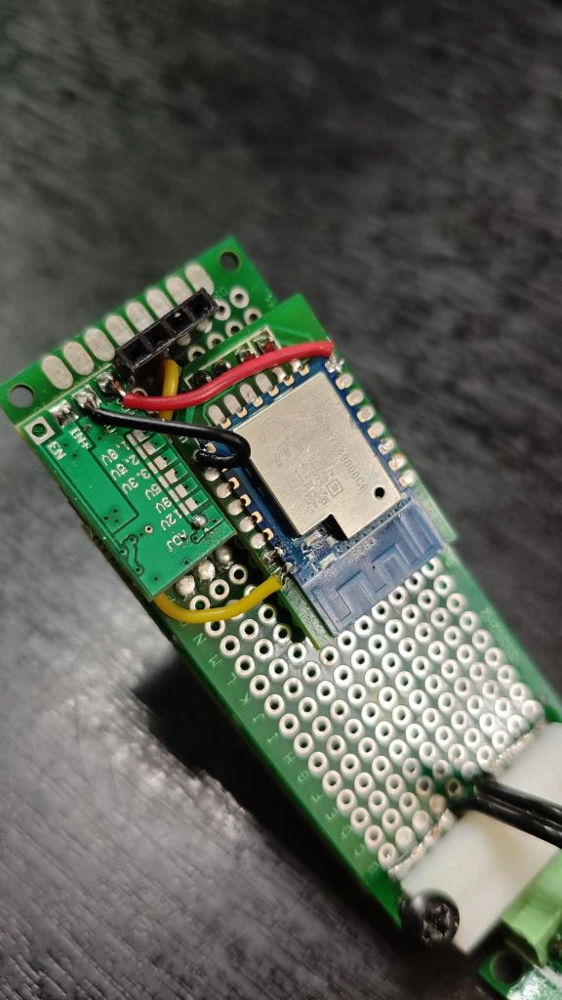
  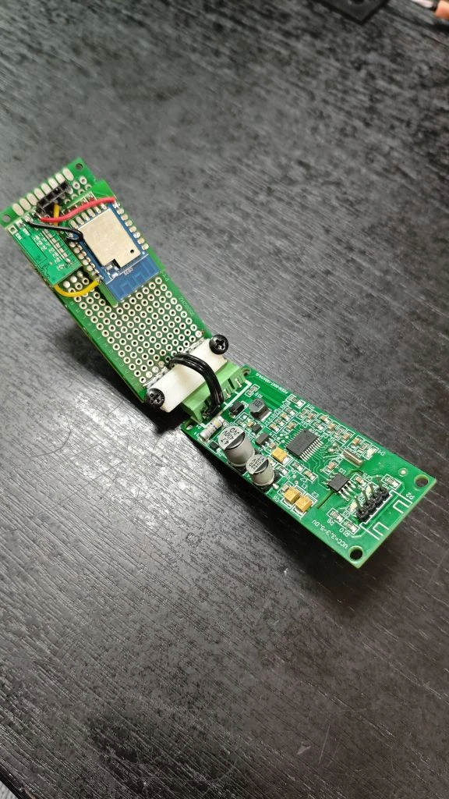
  <br><br>
  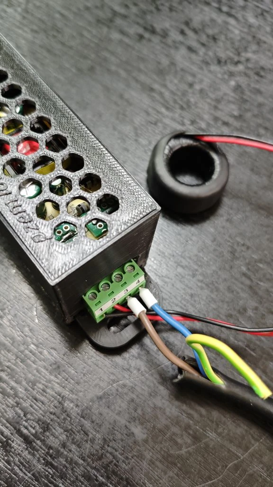
  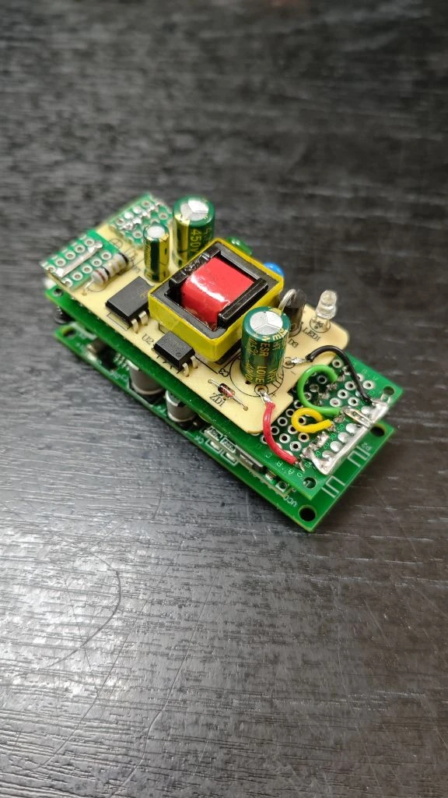
  <br><br>
  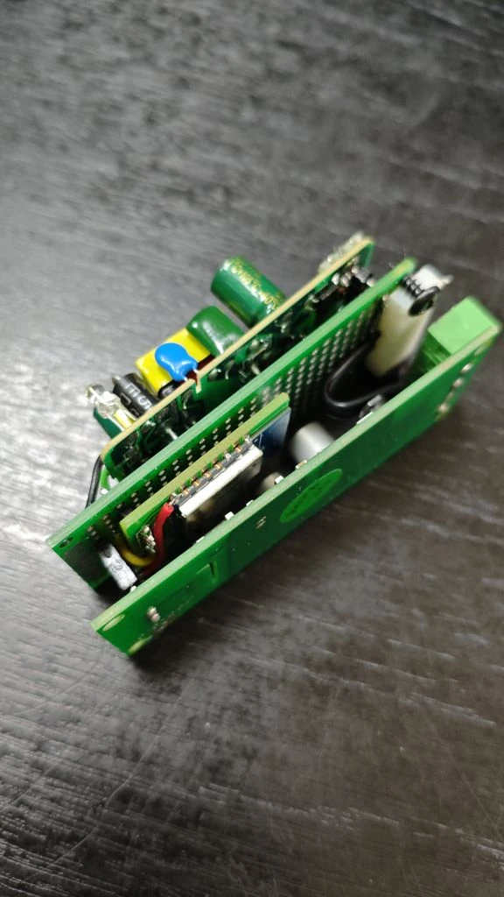
  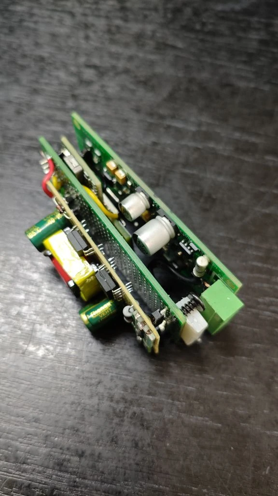
  <br><br>
  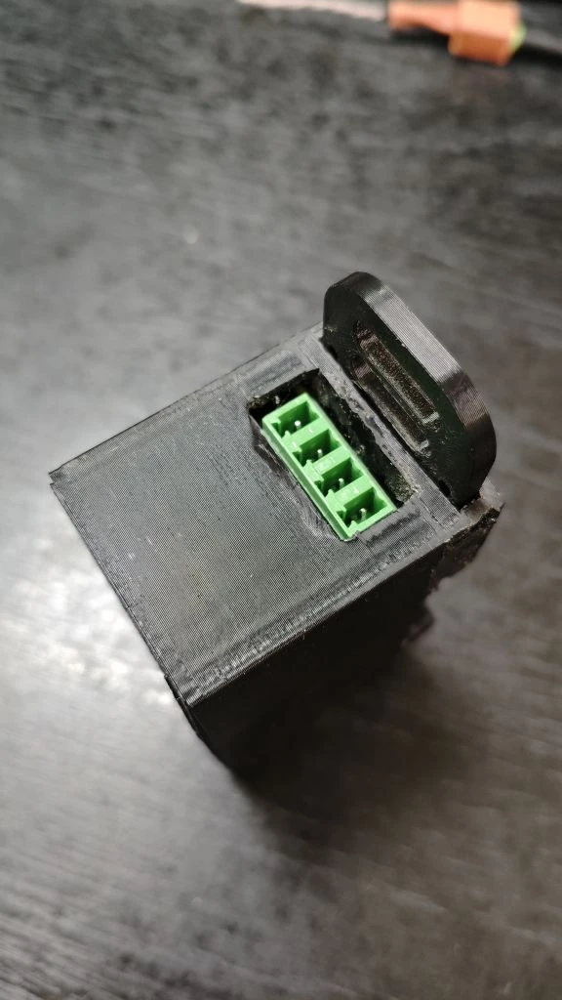
</div>

</details>

## ⁉️ Возможные трудности

-  Так как в моей конфигурации устройство базируется на CB3S (bk7231) то возникнет вопрос, как прошить, так через `esp-home flasher` у вас это сделать не получится! В этом случае вам нужно установить себе программы  `BK7231Flasher` или `ltchiptool`, и прошить с их помощью по UART, затем после прошивки уже возможна дальнейшее обновление с помощью WEB-интерфейса через OTA, что бы не компилировать прошивку я положил готовые файлы для прошивки в `Firmware`.

-  Еще трудность может возникнуть в процессе компиляции прошивки, она возникает из за ораничения мощностей устройства на котором вы компилируете, (например на моем raspbery pi 4 на 4gb компиляция завершалась с ошибкой), решение следущее: нужен ПК (или ноутбук, мини ПК) с достаточным колчиством оперативной памяти, (в моем случае ryzen r5 5600x с 16gb, i5 12400 с 64gb на этих конфигурациях все компилируется без проблем), на устройстве ставим DOCKER DESKTOP, а уже из под docker разворачиваем контейнер с ESP-HOME и из по него правим конфиг и компилируем файл прошивки.
